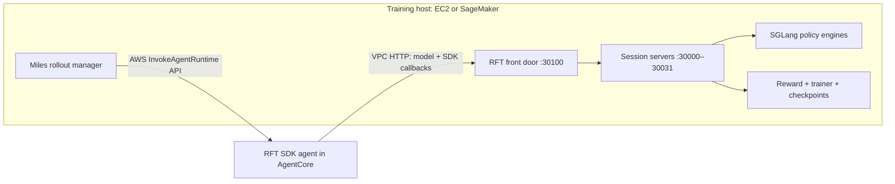

# Miles × Bedrock AgentCore

Run reinforcement learning with [Miles](https://github.com/radixark/miles) while
an Amazon Bedrock AgentCore Runtime executes each agent trajectory. Miles keeps
the model, token recording, reward calculation, optimizer and checkpoints on the
training machine. The agent calls back to that machine for model inference.

This is a standalone example repository. Clone it directly; a separate Miles
checkout is not required when using a compatible Miles container image.

```bash
git clone https://github.com/dreamyang-liu/miles-agentcore-sagemaker.git
cd miles-agentcore-sagemaker
```

| Start here | What it covers |
| --- | --- |
| [Container builds](docs/CONTAINERS.md) | Native AgentCore image, Miles training image, CPU network-smoke image, ECR |
| [AgentCore VPC connection](sagemaker/AGENTCORE_VPC_SETUP.md) | Traffic direction, ports, security groups, IAM, private DNS or IP, network verification |
| [Training walkthrough](docs/TRAINING.md) | Data/model staging, RFT runtime reuse, SageMaker launch, the 27B LoRA recipe |
| [Validation record](docs/VALIDATION.md) | What was actually tested, CPU checks, limits of the current evidence |

## The current RFT path

An agent built with `sagemaker.train.rft` expects a fixed model endpoint and SDK
completion/reward endpoints. `rft_front_door.py` adapts that HTTP contract to
Miles' per-trajectory session URLs.



The AWS invocation and the inference callback are different network directions:

1. Miles registers `trajectory_id → session_url` with the front door.
2. Miles invokes AgentCore with the question, sampling parameters and RFT metadata.
3. The agent sends model requests to its configured `RFT_RUNTIME_ENDPOINT`.
4. The front door routes each request using `X-Amzn-SageMaker-Trajectory-Id`.
5. The SDK reports completion/reward; the front door acknowledges these calls.
6. Miles collects the recorded tokens and computes the actual training reward.

In VPC mode, the callback can use
`http://<head-private-ip>:30100` or a private DNS name. `proxy.py` is not used by
this path as a forwarding service. The supplied SageMaker RFT entrypoint currently automates the private
DNS option; [the VPC guide](sagemaker/AGENTCORE_VPC_SETUP.md#private-ip-or-private-dns)
explains the IP option and its lifecycle requirements.

## Agent modes

| Mode | Agent implementation | Model callback |
| --- | --- | --- |
| `rft` | Your existing RFT SDK/Strands agent image | Fixed front door endpoint; trajectory header selects the session |
| `agentcore` | Native math agent built from [`agent/`](agent/) | Per-trajectory session URL supplied in the invocation |
| `local` | The same **native** math agent, run locally | Direct session URL |

The native agent uses `calculator` and `submit_answer`. The RFT GSM8K agent used
in the current validation uses `calculator` and `finish`, with a different prompt
and agent loop. Switching to `local` is therefore not an equivalent replacement
for that RFT agent.

The source for the externally supplied RFT image is not included here.
[`agent/Dockerfile`](agent/Dockerfile) builds the native example, not that RFT image.

## RFT compatibility boundary

| Request | Behavior |
| --- | --- |
| `POST /v1/chat/completions` | Resolve the trajectory, normalize text-only content blocks, select the policy model, remove incompatible `stream_options`, relay the response |
| `POST /complete-rollout` | Return an acknowledgement; retain diagnostic status for active registrations |
| `POST /update-reward` | Return an acknowledgement; retain diagnostic rewards for active registrations |
| `POST /miles/register`, `DELETE /miles/register/{id}` | Local caller owns routing and cleanup |
| `GET /health` | Front-door process health; does not establish model readiness |

SDK callbacks do not finish a Miles session or replace Miles' training reward.
Unknown inference trajectories return 404, and upstream model errors retain their
status. The connection pool supports 256 upstream connections and 128 idle
connections so 128 simultaneous streaming calls are not limited by HTTPX's
default 100-connection pool.

`RFT_RUNTIME_ENDPOINT` configures the agent's **model client**.
The invocation's `metadata.endpoint` configures the **SDK feedback client**.
For the RFT path, configure both to reach the same front door; changing only the
payload does not move an existing model client.

## Current validation scope

The Qwen3.6-27B LoRA path completed three live RFT training steps on eight H100s,
with 32 prompts × 8 samples = 256 trajectories per step. All 768 samples passed
prompt/token checks and an adapter checkpoint was saved. The BSHD token budget
was 20,000 **including padding**.

That recent GPU validation used an HTTPS callback to a local training host.
Private VPC connectivity and earlier native-agent SageMaker training have
separate historical evidence. A complete 50-step RFT run and the current 27B
recipe entirely inside a SageMaker/private-VPC job are not claimed as verified.
See the [validation record](docs/VALIDATION.md).

The older [`train.sh`](train.sh), [`run_in_docker.sh`](run_in_docker.sh) and
[`README-ec2-public-mode.md`](README-ec2-public-mode.md) describe the legacy native
public-proxy experiment. Use the walkthroughs above for the current RFT/VPC path.
